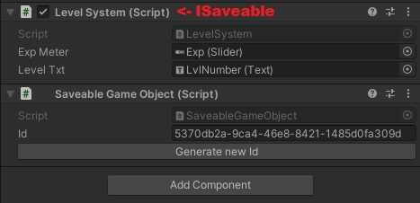
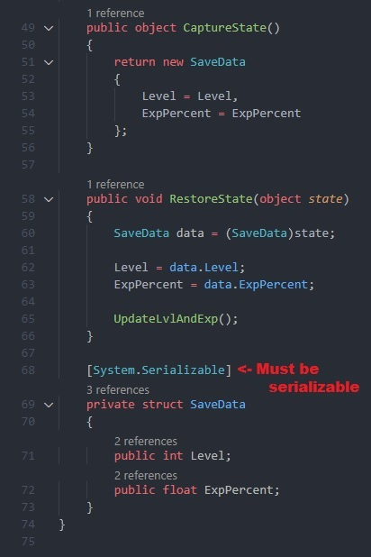

# Saving System for Unity by Varollo
**version 1.0.0**

My implementation of a Saving System for Unity based on an existing tutorial by DapperDino.
> That tutorial can be found here: https://youtu.be/f5GvfZfy3yk

## How to use it
To save data from a MonoBehavior, implement the interface ISaveable and add to the object atatched to that component a SaveableGameObject component.

The ISaveable interface has only two methods, one for capturing the state and one for restoring it, when capturing be sure to return a SERIALIZABLE struct with the data that has to be saved.

Don't forget to add:

> using Varollo.SavingSystem;
